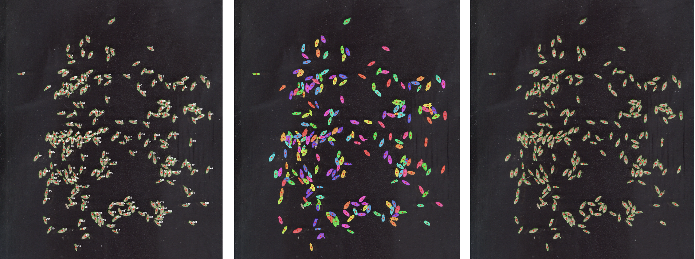

# grainmeter

A small, portable C++/OpenCV command-line tool that counts grains in
flatbed-scanner images and measures per-grain **area, length, width, and
mean color** — the same job GrainScan does, but built to run natively on
Linux, macOS, and Windows (GrainScan itself only runs on Windows), with
batch and multi-threaded processing built in.



## How it works

1. Grayscale + Otsu threshold, auto-detecting whether grains are darker or
   lighter than the background.
2. Morphological open/close to remove scanner speckle noise.
3. Distance-transform + marker-based watershed to split grains that are
   touching or slightly overlapping (the same class of problem GrainScan's
   segmentation step handles).
4. For each resulting region: pixel area, a rotated bounding box
   (`cv::minAreaRect`) for length (long side) / width (short side)
   converted to mm using the scan's DPI (`px_per_mm = dpi / 25.4`), and
   mean R/G/B sampled from the original image under that grain's mask.
5. A region smaller than `--min-area-mm2` (dust/debris) is dropped. A
   region bigger than `--max-area-mm2`, **or** (if `--min-solidity` is
   turned on -- it's off by default) less convex/oval-shaped than that
   threshold (its contour area relative to its convex-hull area -- two
   touching grains form a pinched, concave "peanut" shape even when their
   combined area looks like a normal single grain), is assumed to be an
   unsplit touching-grain cluster: it gets a forced re-split attempt
   (progressively tighter watershed seed spacing on just that region)
   rather than being discarded; if no split is found at any spacing, it's
   kept as a single region rather than dropped. A region touching the
   image border (partial grain) is excluded by default.
6. Outputs a per-grain CSV, a per-file summary CSV, summary statistics on
   stdout, and an annotated QC image so you can visually check the
   segmentation.

## Build

Requires a C++17 compiler, CMake, and OpenCV (core/imgproc/imgcodecs).

**Linux (Debian/Ubuntu):**
```bash
sudo apt install build-essential cmake libopencv-dev
cmake -B build -DCMAKE_BUILD_TYPE=Release
cmake --build build
```

**macOS (Homebrew):**
```bash
brew install cmake opencv
cmake -B build -DCMAKE_BUILD_TYPE=Release
cmake --build build
```

Either of the above produces `build/grainmeter`. The build links only the
OpenCV modules actually used (core/imgproc/imgcodecs, + geometry on
OpenCV 5) rather than every module your local OpenCV happens to have,
which keeps process startup fast even with a "kitchen sink" OpenCV
install.

**Windows 11 (vcpkg):**

The easiest way to get OpenCV on Windows is via
[vcpkg](https://github.com/microsoft/vcpkg), Microsoft's C++ package
manager. You'll need Visual Studio 2022 (the "Desktop development with
C++" workload; the free Build Tools for Visual Studio 2022 also work if
you don't want the full IDE), CMake, and Git.

```powershell
# One-time: install vcpkg and OpenCV (this builds OpenCV from source,
# so it takes a while the first time)
git clone https://github.com/microsoft/vcpkg
.\vcpkg\bootstrap-vcpkg.bat
.\vcpkg\vcpkg install opencv4[core]:x64-windows

# Build grainmeter, pointing CMake at vcpkg's toolchain file
cmake -B build -DCMAKE_TOOLCHAIN_FILE=C:\path\to\vcpkg\scripts\buildsystems\vcpkg.cmake
cmake --build build --config Release
```

Run it with `build\Release\grainmeter.exe --input scan.jpg --dpi 300`.

A few Windows-specific things worth knowing:
- The `-DCMAKE_TOOLCHAIN_FILE=...` flag is what lets `find_package(OpenCV
  REQUIRED)` in `CMakeLists.txt` locate the vcpkg-installed OpenCV;
  without it, the configure step fails with "OpenCV not found". Adjust
  the path to wherever you cloned vcpkg.
- Visual Studio (CMake's default generator on Windows) is a *multi-config*
  generator, unlike the Makefiles/Ninja generators typically used on
  Linux/macOS: the binary ends up in `build\Release\` or `build\Debug\`
  (matching whatever you pass to `--config`), not directly in `build\`.
- `--input scans\*.jpg` works the same as on Linux/macOS: the program does
  its own wildcard expansion (`*` and `?`) rather than relying on the
  shell, since neither `cmd.exe` nor PowerShell expand wildcards for
  external programs the way Unix shells do.
- vcpkg's default triplet (`x64-windows`) is dynamic: it automatically
  copies the OpenCV DLLs next to the built `.exe` ("applocal deployment"),
  so it runs directly from the build folder without extra setup. To
  distribute the `.exe` to another Windows machine, copy that whole
  folder (`.exe` + DLLs), not just the `.exe` by itself. For a single
  self-contained `.exe` with no separate DLLs instead, install with the
  static triplet (`.\vcpkg\vcpkg install opencv4[core]:x64-windows-static`)
  and add `-DVCPKG_TARGET_TRIPLET=x64-windows-static` to the `cmake -B
  build` command above — the build will be larger but has no DLL
  dependencies to carry around.

## Distributing to a Mac without OpenCV installed

A build straight out of `cmake --build build` only runs on machines that
already have your exact Homebrew OpenCV installed — the binary dynamically
links against it from `/opt/homebrew` or `/usr/local`. To share it with
someone who doesn't have that, OpenCV needs to travel with the binary one
way or another. Two options:

**Option A: bundle the dylibs (quick, uses your existing Homebrew build)**
```bash
brew install dylibbundler   # one-time

cmake -B build -DCMAKE_BUILD_TYPE=Release
cmake --build build
cmake --build build --target standalone     # macOS only; runs the script below
```
This produces `dist/grainmeter-macos/` containing the executable plus a
`lib/` folder of OpenCV's dylibs (and their own dependencies — libpng,
libjpeg, zlib, ...), with the executable's load commands rewritten to use
the bundled copies instead of your Homebrew paths. Copy the **whole
folder** (not just the binary) to the other Mac and run `./grainmeter`
from inside it. You can also run the packaging step directly:
```bash
./scripts/package_macos_standalone.sh build
```
Two things worth knowing:
- **Architecture**: the bundle only runs on the same CPU architecture it
  was built on — arm64 (Apple Silicon) or x86_64 (Intel), not both. If you
  need to support the other architecture too, build (and run this script)
  on a Mac of that architecture, or investigate a universal (`lipo`-merged)
  build of both the binary and OpenCV — not something this script does
  for you.
- I wrote and syntax-checked this script but couldn't run it end-to-end
  myself — bundling needs real macOS tooling (`dylibbundler`, `otool`,
  `codesign`) not available in the Linux sandbox I build in. It uses
  `set -euo pipefail`, so if a step fails it stops right there with the
  real error rather than silently producing a broken bundle.

**Option B: static linking (a single self-contained file, more setup)**
If you'd rather ship one file with no accompanying folder, OpenCV needs to
be built as static libraries first — Homebrew's `opencv` formula only
ships shared libraries, so this means building OpenCV from source with
`-DBUILD_SHARED_LIBS=OFF` (via `cmake` directly, or a package manager
that supports static builds, e.g. vcpkg with a `-static` triplet), then
pointing this project's build at that static install instead of Homebrew's.
That's a larger undertaking than this README covers in detail — Option A
above is the more practical path for most cases.

## Usage

**Single image:**
```bash
./build/grainmeter --input scan.jpg --dpi 300
```
Writes `results/scan.csv` and `results/scan_annotated.jpg` (see
"Output files" below).

**Batch (all JPGs in a folder), using all CPU cores:**
```bash
./build/grainmeter --input scans/*.jpg --dpi 300
```
Or, if you want grainmeter itself (rather than your shell) to expand the
pattern — useful with very large folders, or in scripts — quote it:
```bash
./build/grainmeter --input "scans/*.jpg" --dpi 300
```
Both forms work the same way; multiple explicit files also work:
`--input a.jpg b.jpg c.jpg`.

Full options:
```
--input <path> [<path> ...]   One or more images, and/or a glob pattern    [required]
--dpi <n>                     Scan resolution, dots per inch                (300)
--out-dir <path>               Output folder, created if needed             (results)
--out-csv <path>               Per-grain CSV path (single-file runs only)   (see below)
--out-image <path>             Annotated QC image path (single-file only)   (see below)
--summary-csv <path>           Cross-file summary CSV path                  (see below)
--min-area-mm2 <n>             Reject regions smaller than this             (3.0)
--max-area-mm2 <n>              Regions bigger than this get re-split,
                                 not discarded (see "How it works")          (20.0)
--polarity <auto|dark|light>   Grain vs. background brightness              (auto)
--no-watershed                 Disable splitting of touching grains
--include-border                Keep grains touching the image edge
                                 (default: excluded)
--seed-separation-mm <n>        Min distance between distinct watershed
                                 seed peaks                                  (2.0)
--seed-merge-mm <n>             Merge distance for nearby seed points
                                 into one grain                              (2.0)
--crease-close-mm <n>           Pre-seeding gap-closing size, to bridge a
                                 grain's own crease/notch (0 disables)       (0.6)
--min-solidity <n>              Non-oval regions get a forced re-split
                                 attempt (0-1, 0 disables)                   (0, off)
--color-seeds                   Distinct fill/outline color per grain in
                                 the annotated image (GrainScan-style)       (off)
--show-ids                      Draw each grain's id number in the
                                 annotated image                             (off)
--threads <n>                   Parallel worker threads for batch
                                 processing                                  (CPU core count)
--debug                         Dump intermediate mask/distance images
                                 for tuning
--help                          Show usage
--version                       Show version number and exit
```

### Output files

By default, everything is written under `--out-dir` (default `results/`,
created automatically):
- `<out-dir>/<name>.csv` — same base name as the input, extension swapped to `.csv`
- `<out-dir>/<name>_annotated.<ext>` — same base name, `_annotated` appended, original extension kept
- `<out-dir>/summary.csv` — **one row per input file** (see below), always written,
  whether you ran on a single image or a whole batch

e.g. `wheat_plot12.jpg` → `results/wheat_plot12.csv` and
`results/wheat_plot12_annotated.jpg`.

The annotated image outlines each kept grain in green with a red dot at
its centroid, so you can visually cross-check the count and catch any
obviously wrong splits/merges. Each grain's outline comes from its own
individually measured region, so a touching pair that watershed correctly
split into two grains is drawn as two separate outlines, not one merged
outline around the whole original cluster.

`--show-ids` (default off) additionally draws each grain's id number next
to its dot, in white or black depending on which gives better contrast
against the scan's detected background. Off by default because on a
scan with hundreds of grains the numbers get busy fast and mostly aren't
needed for a routine QC pass — turn it on when you need to cross-reference
a specific grain between the image and its row in the CSV.

`--color-seeds` (default off) replaces the plain green outline with a
GrainScan-style view: each grain gets its own distinct color (stepped
around the color wheel so neighboring ids look different), semi-transparent
filled over the grain so its texture stays faintly visible, with a solid
outline of the same color around it. Off by default because a single
consistent color is easier to read at a glance for routine QC; turn it on
when you specifically want to visually distinguish individual grains
touching a neighbor, e.g. to spot-check a dense cluster.

`--out-csv`/`--out-image` let you override both per-grain output paths
explicitly, but only apply when exactly one input file is given — with
multiple/glob inputs there's no single filename that makes sense for all
of them, so those flags are ignored (with a warning) in favor of the
`--out-dir` convention. `--summary-csv` overrides the summary path in
either mode (single-file or batch).

### CSV columns

**Per-grain CSV** (`<name>.csv`): `id, area_mm2, length_mm, width_mm, mean_r, mean_g, mean_b`

- `length`/`width` are the long/short axis of the rotated bounding box fit
  to each grain outline (the standard measure used by grain-phenotyping
  tools such as GrainScan/SmartGrain).
- `mean_r`/`mean_g`/`mean_b` are the mean red/green/blue channel values
  (0-255) of the pixels inside that grain's mask, sampled from the
  original (unblurred, unthresholded) image — useful as a proxy for grain
  color/brightness traits.

**Summary CSV** (`summary.csv`, one row per input file):
`filename, seed_count, mean_area_mm2, mean_length_mm, mean_width_mm, mean_r, mean_g, mean_b, oversized_before_split`

- `seed_count` is the number of grains counted (post-filtering) in that file.
- The `mean_*` columns are that file's per-grain averages from its own CSV.
- `oversized_before_split` is how many regions initially measured above
  `--max-area-mm2`, *before* the forced re-split attempts described below --
  whether or not those attempts went on to actually split them. A high
  number here relative to `seed_count` is the signal to raise
  `--max-area-mm2`: either real grains in this scan are bigger than the
  threshold assumes, or touching pairs are common (check the stdout
  summary's "Still oversized after split attempts" for the same file --
  a big gap between the two numbers means splitting is usually
  succeeding on its own; numbers close together mean it usually isn't,
  and raising the threshold would help more directly).
- A file that failed to load gets a row with `seed_count` 0 and blank
  averages rather than being silently dropped, so you can spot it in the summary.

### Batch processing & threads

Any number of `--input` files (explicit list or glob) triggers batch mode:
each file is processed independently (its own CSV + annotated image under
`--out-dir`) and a batch summary is printed at the end. Files are
distributed across a thread pool sized by `--threads` (default: number of
CPU cores, capped at the number of files). Progress lines from different
threads are tagged with the file's name (e.g. `[scan_a] Segmenting...`) and
are never interleaved mid-line, so batch output stays readable even at
high thread counts. Single-file runs are unaffected — they always use one
thread.

## Tuning for your scans

- **`--min-area-mm2`**: anything smaller is dropped as dust/debris noise.
  Run once with a very permissive bound (e.g. `--min-area-mm2 0.1`), sort
  the `area_mm2` column from the CSV, and look for the gap between a
  cluster of clearly-too-small specks and the real population -- set the
  bound just above that gap. The current default (3.0) was tuned this way
  against a real scan of small grains (not idealized wheat) with a black
  backing board, where noise topped out below ~0.7 mm² and the real
  population started at ~2.8 mm².
- **`--max-area-mm2`**: a region bigger than this is assumed to be an
  unsplit touching-grain cluster, not debris -- it gets a forced re-split
  attempt (progressively tighter seed spacing on just that region) rather
  than being discarded. If a genuine split is found, each piece is counted
  individually; if no split is found at any spacing (i.e. it really is one
  large object), it's kept as a single region rather than dropped. The
  summary reports both "Oversized before split attempts" (everything that
  triggered this check, split or not) and "Still oversized after split
  attempts" (only the ones that couldn't be split) -- a big gap between
  the two means splitting is doing its job; numbers close together mean
  most oversized regions aren't splitting successfully, which is the
  signal to raise this threshold instead of relying on the retry. The
  "before" count is also written per-file to `summary.csv` as
  `oversized_before_split`, so you can spot files worth investigating
  across a whole batch without reading every stdout log individually.
  Tune the default (20.0) the same way as
  `--min-area-mm2`: sort `area_mm2` from a permissive run and look for the
  gap between the real population and a handful of much-larger outliers.
  On a real reference image tested during development, that gap sat
  between ~19.5 mm² and 22-29 mm² for the 3 pairs that hadn't separated on
  the first pass.
- **`--min-solidity`** (default 0, i.e. off): catches a case
  `--max-area-mm2` alone can't -- two touching grains whose *combined*
  area still looks like a plausible single grain, but whose *shape* is
  visibly wrong: pinched and concave at the waist where they touch,
  instead of convex like a real grain. "Solidity" is `contour area /
  convex-hull area` (via `cv::convexHull`); a true oval is close to
  convex (solidity near 1.0), while a touching pair's pinched waist
  drags it down. A region below this threshold gets the same forced
  re-split attempt as an oversized one, and is likewise kept (not
  dropped) if no split is found, counted in "Still not oval-shaped
  after split attempts" in the summary.

  **It's off by default because getting the threshold wrong is easy and
  costly.** Real single grains are not perfect ellipses -- surface
  texture, awn stubs, a visible crease, and ordinary shape asymmetry
  commonly bring solidity down into the 0.80-0.95 range even for a
  genuinely single grain. On a real reference image tested during
  development, sweeping this threshold showed a sharp jump in flagged
  regions between 0.85 and 0.90 (226 vs 233 grains counted) that wasn't
  matched by a similar jump in genuinely-successful splits -- strong
  evidence that band is mostly ordinary single-grain shape variation,
  not touching pairs, and an enabled-by-default threshold risked
  quietly mis-splitting ordinary grains on scans this tool had never
  seen. **0.75 is a reasonable value to start with if you want to turn
  it on**: on that same reference image, 0.75 left only 1 region
  flagged after every split attempt failed (versus 67 at 0.90), a much
  more plausible "genuinely couldn't be split further" count, while
  still recovering several genuine touching pairs the area check alone
  had missed. If you suspect touching pairs are slipping through as
  single grains, turn this on starting around 0.75 and adjust from
  there, checking `debug_sure_fg.png` and the annotated image rather
  than jumping straight to an aggressive value -- and watch the "Still
  not oval-shaped" count for a similar sharp jump on your own images,
  which would suggest you've crossed into your own grains' natural
  shape-variation range the same way 0.85-0.90 did on the reference
  image.
- **Touching grains**: watershed seeds splits from local maxima of the
  distance transform -- a pixel becomes a seed if it's the peak within
  `--seed-separation-mm` (default 2.0) of itself. These local-maxima
  peaks deliberately never compare one grain against another (global or
  per-blob) -- earlier versions of this tool tried both, and each let
  some grains silently disappear or under-split depending on what else
  was in the scan; every grain's seed now only depends on its own shape.
  Three flags tune this without needing to recompile:
  - **`--seed-merge-mm`** (default 2.0): merges nearby near-tied seed
    points into one. **Try raising this first** if a single grain is
    showing up as 2 (or more) points in `debug_sure_fg.png` -- the
    distance transform's fast approximation can produce a couple of
    separate near-maximal pixels close to a true peak instead of one
    clean point, and this is the most common cause of over-splitting.
  - **`--crease-close-mm`** (default 0.6): a small gap-closing pass run
    only for seed-finding (it never changes the actual measured shape),
    aimed at a different cause of the same 2-points-per-grain symptom --
    a real physical crease (e.g. a wheat kernel's sulcus) that's light
    enough to threshold as background can pinch the binary silhouette
    into two lobes, which genuinely produces two distance-transform
    peaks rather than one. If `--seed-merge-mm` alone doesn't fix a
    persistent 2-seeds-per-grain pattern, raise this instead (or check
    `debug_binary.png` for a visible notch running through each grain).
    Set to 0 to disable if your grains have no such crease and you'd
    rather not risk it bridging anything else. This is also why a
    `--min-solidity`-triggered re-split (see above) keeps crease-closing
    enabled during its retry, unlike an oversized-triggered one: a
    genuinely single but creased grain has naturally low solidity too,
    and without crease-closing active during the retry, the forced
    re-split could wrongly cut it in two at the crease. An
    oversized-triggered retry disables it instead, since being oversized
    is a much stronger signal that it's a real cluster, so maximizing
    split aggressiveness there is the safer trade-off.
  - **`--seed-separation-mm`**: lower it if genuinely touching grains are
    being merged into one (missed splits); raise it if one grain is being
    split into more than one for a reason unrelated to the two causes
    above.
  `--no-watershed` disables splitting entirely if your images have no
  touching grains.
- **Debug images**: `--debug` writes `<name>_debug_sure_fg.png` (one blob
  per grain if seeding is working correctly) and `<name>_debug_binary.png`
  (the thresholded silhouette, useful for spotting a crease/notch). It
  also prints a line to stderr every time a `--min-solidity`-triggered
  re-split succeeds (region location, solidity, and how many pieces it
  split into) or fails (stays as one region after every spacing tried),
  so you can see exactly which regions the shape check is acting on
  rather than only the aggregate count in the summary. If a grain you
  expect to see is missing from your final count, check whether it has a
  seed at all (if not, it's a segmentation/thresholding issue upstream,
  e.g. `--polarity`) versus whether it has a seed but got filtered out by
  `--min-area-mm2` or `--include-border` (or, less often, never got a
  seed to split from in the first place if it's part of an oversized or
  non-oval region that couldn't be re-split -- check for it under "Still
  oversized" / "Still not oval-shaped after split attempts" in the
  summary). If a grain you expect to see as one is showing as two, see
  the flags above.
- **Background**: works with either a light (paper) or dark background;
  `--polarity` forces the choice if auto-detection picks the wrong class
  on a low-contrast scan.
- **Scan quality**: as with GrainScan, even, diffuse lighting and a
  background that contrasts clearly with grain colour matters more than
  anything else for accuracy. A dark (black or navy) backing behind the
  grains tends to give the cleanest segmentation on a flatbed scanner.
- Use `--debug` to inspect `<name>_debug_binary.png`,
  `<name>_debug_distance.png`, `<name>_debug_sure_fg.png`,
  `<name>_debug_sure_bg.png` (written next to the executable) and adjust
  from there.

## Validation

Tested against a synthetic scan of 60 ellipse "grains" (known length/width,
some touching) rendered at 300 dpi. For grains with no neighbor closer than
their own size (i.e. truly isolated), measured length and width matched
ground truth to within ~0.05–0.1 mm on average — real scans will have more
noise from grain surface texture and awns, so validate against a handful of
hand-measured grains from your own scanner before trusting it for a full
dataset.

Also tested against a synthetic scan with one large, round outlier grain
(e.g. a stray weed seed or debris) alongside 25 normal, well-separated
wheat-sized grains: earlier seeding logic that compared each grain's
distance-transform peak against a single global (or per-blob) maximum let
the outlier's much larger peak wipe out most of the normal grains' seeds
entirely -- only 1 of 26 grains got a seed in that version, and the missing
25 simply vanished from the count with no error. The current local-maxima
seeding (each grain's peak judged only against its own neighborhood, never
against any other grain) finds all 26 correctly, with length/width accuracy
matching the isolated-grain numbers above.

Also tested against a synthetic scan of 20 grains each with a real
crease-like feature (a lighter line thresholding as background, pinching
the binary silhouette into two lobes) -- without `--crease-close-mm`
(disabled via `--crease-close-mm 0`), every single grain produced exactly
2 seeds (40 from 20 true grains); with the default 0.6mm crease-closing
enabled, seeding matches truth exactly (20/20), with no change to the
actual measured length/width (crease-closing is only used to decide where
to place seeds, never to alter the measured shape). The same crease test
was re-run with `--min-solidity 0.75` (it's off by default -- see below)
to confirm turning it on doesn't regress this fix -- still exactly 20/20,
since a solidity-triggered retry keeps crease-closing active (see the
`--crease-close-mm` section above for why).

`--min-solidity` shipped enabled by default (0.75) briefly during
development, calibrated against a real reference image, not picked
arbitrarily: an initial value of 0.90 flagged 67 of 233 grains as still
non-oval after every re-split attempt failed, and inspecting those showed
most clustered at 0.79-0.89 solidity -- ordinary single-grain shape
variation (texture, crease, asymmetry), not touching pairs, evidenced by
a sharp, disproportionate jump in flagged count specifically between the
0.85 and 0.90 thresholds (226 vs 233 grains) with no matching jump in
genuinely successful splits. At 0.75 on the same image, only 1 region
remained flagged after exhausting every retry spacing, while 5 net-new
grains were correctly recovered from touching pairs that had looked like
a single normal-area blob to the area check alone; the split pieces'
sizes were checked against the known legitimate small-grain range for
that image to rule out degenerate slivers from a bad split. Despite that
result, it now ships **off** by default: 0.75 was calibrated against one
image, and getting this threshold wrong on a different scan risks
quietly mis-splitting ordinary grains rather than just missing some
touching pairs, which is the worse failure mode of the two -- so this
stays an opt-in tool for scans where you've confirmed touching pairs are
slipping through, not a default behavior.

Also stress-tested on a synthetic full letter-page (2550x3300 px) scan with
600 grains plus 4000 noise specks: several hundred grains measured
correctly in a couple of seconds. The tool prints progress to stderr as it
works (image loaded, segmenting, watershed splitting, measuring N regions,
writing results) so a large scan doesn't look stuck while it's processing.
Batch mode with 3 files (including one full-page-size scan) using 3
threads completed in about 1 second in testing.

The annotated-image changes (background-contrasting id labels off by
default via `--show-ids`, per-grain outlines, `--color-seeds`) were
checked by pixel-sampling the actual output rather than by eye alone: on
the real dark-background reference image, the default output (no id
labels) came back with only ~22 near-white pixels — essentially zero,
consistent with the labels genuinely being absent rather than just small
— while `--show-ids` produced ~50k near-white pixels, in the expected
ballpark for a font roughly half the linear size of an earlier version
that had produced ~159k (font area shrinks faster than linear size, so
a 50% size cut plus a thinner stroke landing around a 3x pixel-count
reduction is consistent with the math, not just a rough guess). The same
check confirmed black text renders correctly on a light-background
synthetic test too. `--color-seeds` output was checked for genuine color
diversity by sampling real pixel values across a dense touching cluster
(distinctly different hues came back at each sample point, not a single
repeated color). All of the counting/measurement regression tests above
were re-run after these changes and produced identical grain counts to
before, confirming they're purely visual with no effect on detection.

## Known limitations vs. GrainScan

- Heavily overlapping grains (>~40% overlap) can still be under-split, or
  a forced re-split of an oversized region can occasionally cut a
  genuinely-single elongated grain if it happens to have two comparably
  strong distance-transform peaks; physically separating grains on the
  scanner bed before scanning remains the most reliable fix, same as with
  GrainScan.
- No built-in per-pixel calibration from a reference object (e.g. a ruler
  or known-size disc in the scan) — DPI is taken as ground truth from the
  scanner setting, which is accurate as long as your scanner driver isn't
  lying about its resolution.


## Acknowledgement
This app used [OpenCV](https://opencv.org/) library and was written with the help of [Claude AI](https://claude.ai/).